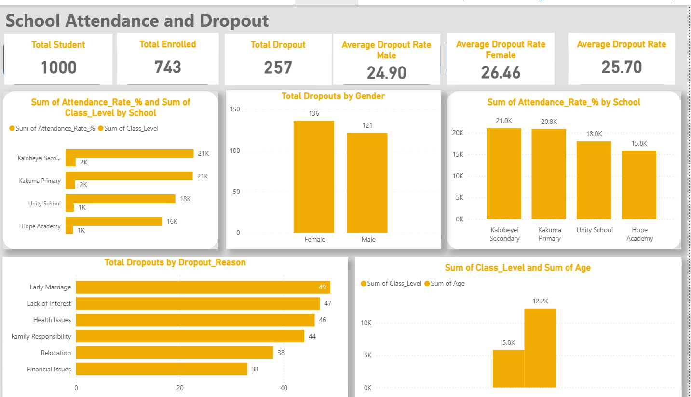
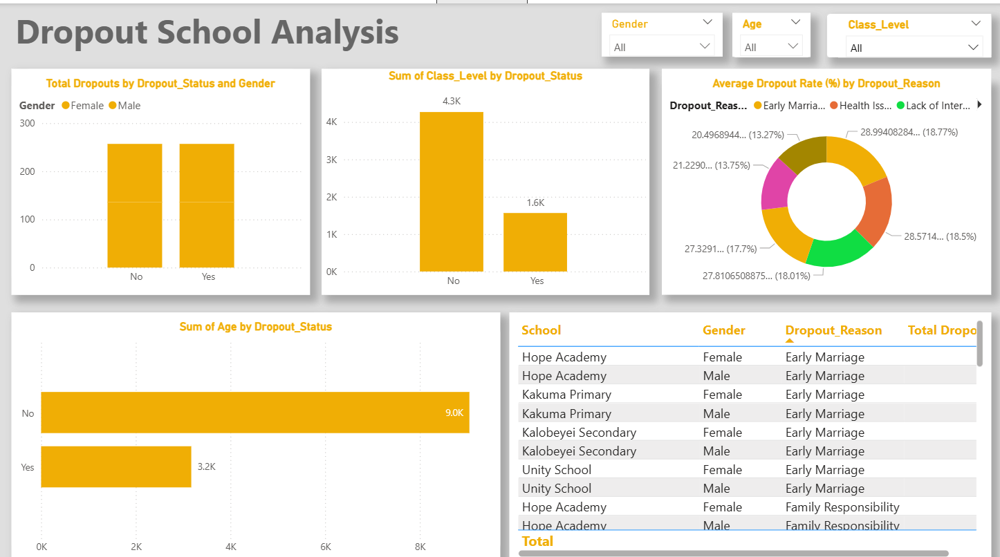

# School-Attendance-and-Dropout-Patterns-in-Kakuma-Analysis-Project

## 📊 Project Overview

This capstone project focuses on analyzing school attendance and dropout patterns within the **Kakuma Refugee Camp**. The goal is to uncover insights that can help improve educational outcomes for refugee children and youth by using real-world data and modern data analytics techniques. 

The project leverages tools like **Microsoft Excel** for data cleaning and **Power BI** for visualization, helping to communicate findings clearly through dashboards and presentations.

---

## 📁 Dataset

**File Name:** `kakuma_education_access.csv`  
This dataset contains the following fields:

- `Student_ID`: Unique identifier for each student  
- `School`: School name  
- `Gender`: Male or Female  
- `Age`: Student age  
- `Class_Level`: Grade or class  
- `Attendance_Rate`: Attendance rate in percentage  
- `Dropout_Status`: Yes/No status indicating dropout  
- `Reason_For_Dropout`: Stated reason for dropping out  

---

## 🎯 Project Objectives

### 1. Data Preparation
- Cleaning missing values and fixing inconsistencies  
- Standardizing formats (e.g., percentages, names)  
- Grouping data by age ranges and categories  
- Creating new fields such as:
  - **Dropout Rate per School**
  - **Attendance Score**
  - **Gender-based Aggregations**

### 2. Key Analytical Questions
- Which schools have the highest and lowest dropout rates?
- What are the gender differences in attendance/dropout?
- What are the top reasons students drop out?
- How do dropout patterns vary by age and class level?
- Are there seasonal or yearly changes in attendance?

---

## 🛠 Tools Used

- **Microsoft Excel** – For data cleaning & transformation  
- **Power BI** – For building dashboards and visualization  

---

## 🧾 Deliverables

### 📌 Power BI Dashboard (2 Pages Minimum)
1. **School Overview Dashboard**  
   - Dropout rate by school  
   - Total enrollment & dropouts  
   - Filters by school name and year  

2. **Demographics & Dropout Reasons**
   - Gender and age group analysis  
   - Common dropout reasons  
   - Trendline and time-based visuals  

_Screenshot examples to be added below:_  
  

---

### 📑 PowerPoint Presentation (10–15 Slides)
- **Intro & Objectives**
- **Dataset Description**
- **Methodology**
- **Findings (with visuals)**
- **Recommendations**
- **Limitations & Future Research**
- **Conclusion**

---

## 🔍 Insights & Recommendations

- Female students are more likely to drop out due to early marriage or lack of menstrual support.  
- Some schools show outstanding retention rates and should be modeled.  
- Attendance rates fluctuate based on seasons, especially during planting or harvesting periods.  

---

## 🙋‍♂️ Author

**Duelkuoth Joseph Gok**  
Data Analytics Capstone Project – July 2025

---

> ⚠️ **Disclaimer:** This project was developed for academic purposes using real data. It is not intended for direct policy use without further validation by relevant stakeholders.

